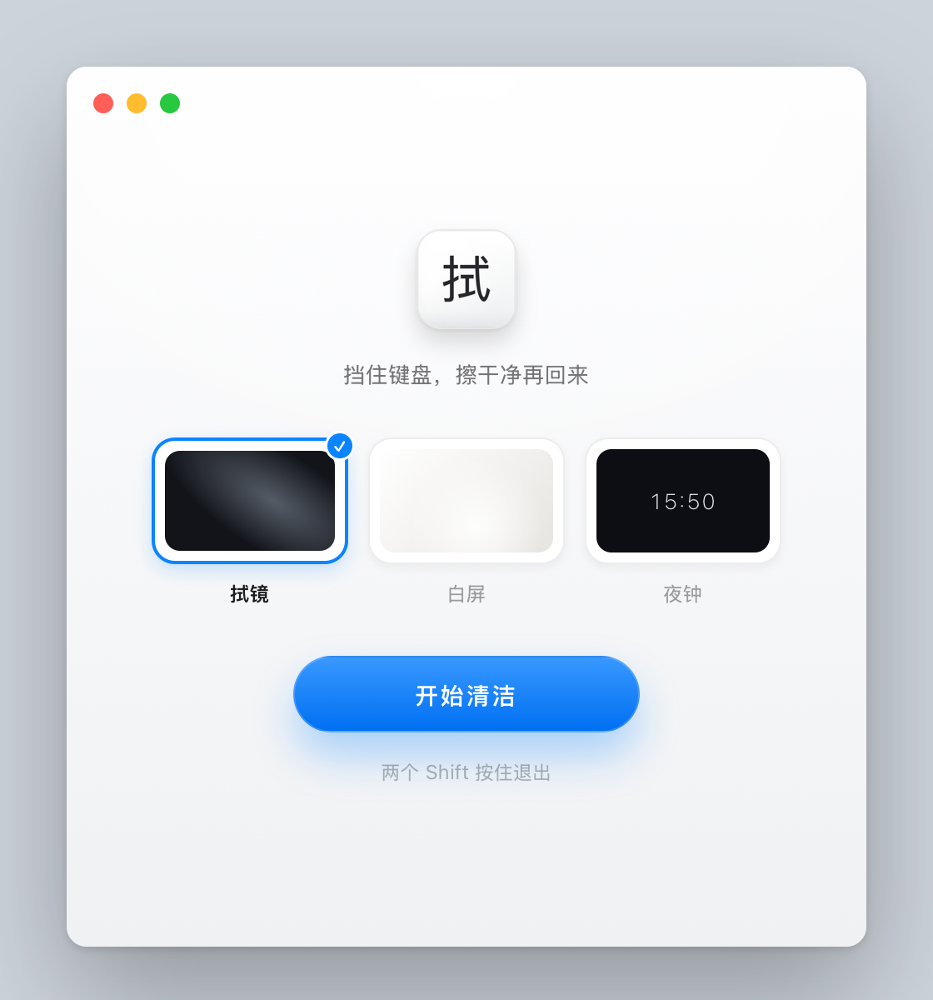
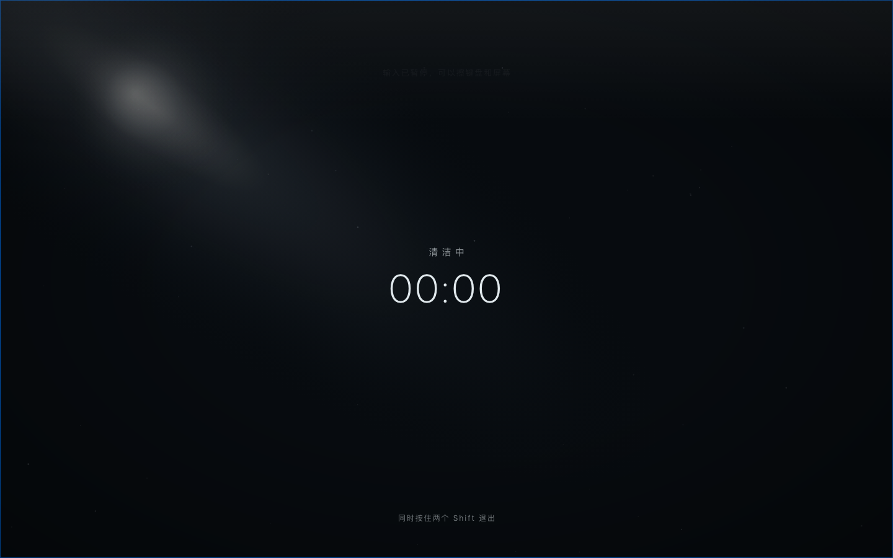
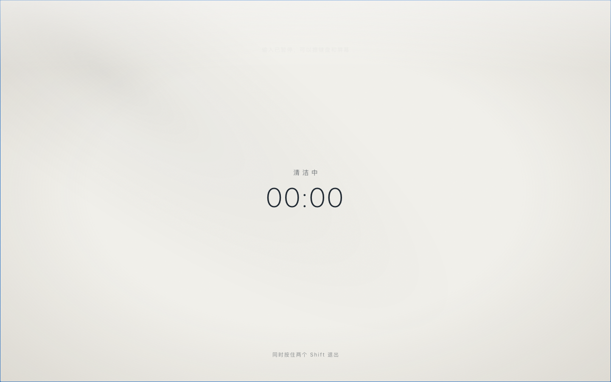
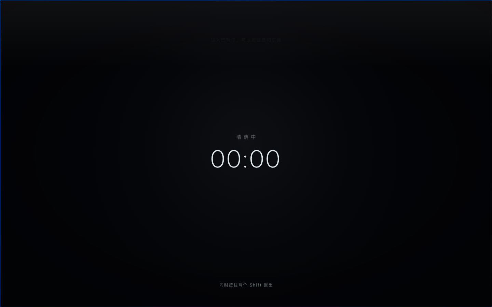

# 拭（Shi）

[简体中文](README.md) | [繁體中文](README.zh-Hant.md) | [English](README.en.md) | [日本語](README.ja.md) | [한국어](README.ko.md) | [Español](README.es.md)

拭是一款免费、开源的 macOS 键盘与屏幕清洁辅助工具。进入清洁模式后，它会暂时拦截键盘输入，默认遮挡触控板和鼠标点击，并让屏幕变暗，减少擦拭时的误操作。清洁完成后，按住退出组合键即可恢复使用。

[下载最新版](https://github.com/JTXYH/shi/releases/latest) · [反馈问题](https://github.com/JTXYH/shi/issues) · [MIT 许可证](LICENSE)

## 功能

- **清洁时暂停输入**：拦截键盘输入，可选择是否同时遮挡触控板和鼠标点击。
- **三种清洁画面**：拭镜、白屏、夜钟，支持在多个显示器上显示清洁画面。
- **屏幕变暗与恢复**：清洁时调暗显示器，退出后恢复；实际效果取决于显示器和 macOS 的支持情况。
- **快捷开始与退出**：应用运行时，按 `Control + Option + Command + C` 开始；按住左右两个 `Shift`，或 `Shift + Esc` 退出。
- **可调节的清洁时长**：设置退出长按时间和自动结束时间，避免清洁模式一直保持开启。
- **六种界面语言**：简体中文、繁體中文、English、日本語、한국어、Español。
- **应用内更新**：通过 Sparkle 检查更新，并验证更新签名。

## 截图

<p align="center">
  
</p>

<p align="center">
  
  
  
</p>

<p align="center"><sub>拭镜 · 白屏 · 夜钟</sub></p>

## 系统要求

- macOS 14 Sonoma 或更高版本。
- Apple Silicon 或 Intel Mac，构建产物为 Universal 2 应用。
- 清洁模式需要 macOS「辅助功能」权限。

## 安装

1. 从 [GitHub Releases](https://github.com/JTXYH/shi/releases/latest) 下载应用 ZIP 压缩包。
2. 解压后，将 `Shi.app` 移到「应用程序」文件夹。
3. 打开应用，按下方说明开始使用。

当前默认分发采用 ad-hoc 签名，未经过 Apple 公证。若首次启动时提示无法验证开发者或无法检查恶意软件，请先确认文件来自本仓库且未被篡改，再按 [Apple 的打开说明](https://support.apple.com/en-us/102445) 操作。不要忽略 macOS 明确检测到恶意软件的提示。

## 使用方法

1. 打开拭，选择喜欢的清洁画面，点击「开始清洁」。应用运行时也可使用 `Control + Option + Command + C`。
2. 首次使用时，按引导前往「系统设置 › 隐私与安全性 › 辅助功能」，为拭开启权限。如果列表中没有拭，可用 `+` 添加 `Shi.app`。**完成授权后会自动开始清洁。**
3. 清洁完成后，同时按住左右两个 `Shift`，或按住 `Shift + Esc`。默认持续 **1.5 秒**即可退出，恢复输入和屏幕亮度。

可在设置中调整：

| 设置 | 默认值 | 可选值 |
| --- | --- | --- |
| 退出长按时间 | 1.5 秒 | 1 秒、1.5 秒、2 秒 |
| 最长清洁时间 | 10 分钟 | 5 分钟、10 分钟、关闭自动结束 |
| 遮挡触控板和鼠标点击 | 开启 | 开启或关闭 |

首次启动会根据 macOS 首选语言选择界面语言；不支持该语言时使用英语。手动选择的语言会保存到本机。

电源键和 Touch ID 无法被拦截。离开电脑时请使用 macOS 系统锁屏。

## 权限、隐私与更新

- 辅助功能权限用于在清洁模式期间拦截键盘输入；应用不记录按键内容，不收集使用统计，偏好设置保存在本机。
- 清洁功能可以离线使用，无需注册账户。更新检查和更新包下载需要联网。
- 正式构建通过 HTTPS 获取更新信息，并使用 Sparkle 的 Ed25519 签名验证 appcast 和更新包。可在设置中手动检查更新；调试构建禁用更新检查。
- ad-hoc 签名的应用更新或重新构建后，macOS 可能要求重新授予辅助功能权限。如果无法开始清洁，请在辅助功能列表中重新启用拭。

安全漏洞请按 [安全政策](SECURITY.md) 私下报告。

## 从源码构建

开发环境需要 macOS 和 Xcode 16 或更高版本，并将命令行工具指向该 Xcode。项目使用 Swift、SwiftUI 和 AppKit，通过 Swift Package Manager 引入 [Sparkle](https://github.com/sparkle-project/Sparkle)，当前锁定版本为 2.9.2。首次构建需要联网获取依赖。

```sh
git clone https://github.com/JTXYH/shi.git
cd shi
./scripts/build-app.sh debug
open dist/Shi.app
```

脚本构建同时包含 `arm64` 和 `x86_64` 的 `dist/Shi.app`，默认使用 ad-hoc 签名，本地构建无需 Developer ID 证书。也可以在 Xcode 中打开 `Shi.xcodeproj`，选择 `Shi` scheme 开发和调试。

在仓库根目录运行现有的语言选择检查：

```sh
./scripts/test-language-selection.sh
```

该检查覆盖系统语言识别和已保存语言的优先级，不替代真实 Mac 上的清洁、权限与显示器测试。

## 参与贡献

欢迎通过 [Issues](https://github.com/JTXYH/shi/issues) 和 [Pull Requests](https://github.com/JTXYH/shi/pulls) 提交问题、改进和翻译。

- 报告问题时，请提供应用版本、macOS 版本、Mac 型号、复现步骤和预期结果；显示问题请补充显示器配置。
- 提交改动时，请说明修改原因和验证方式。界面改动请附截图；输入拦截、退出或亮度相关改动请在真实 Mac 上验证。
- 修改功能说明或翻译时，请同步六份 README；应用内文案位于 [Shi/Localization.swift](Shi/Localization.swift)。

## 许可证

本项目由 [JTXYH](https://github.com/JTXYH) 维护，采用 [MIT 许可证](LICENSE)。第三方依赖遵循各自的许可证。
